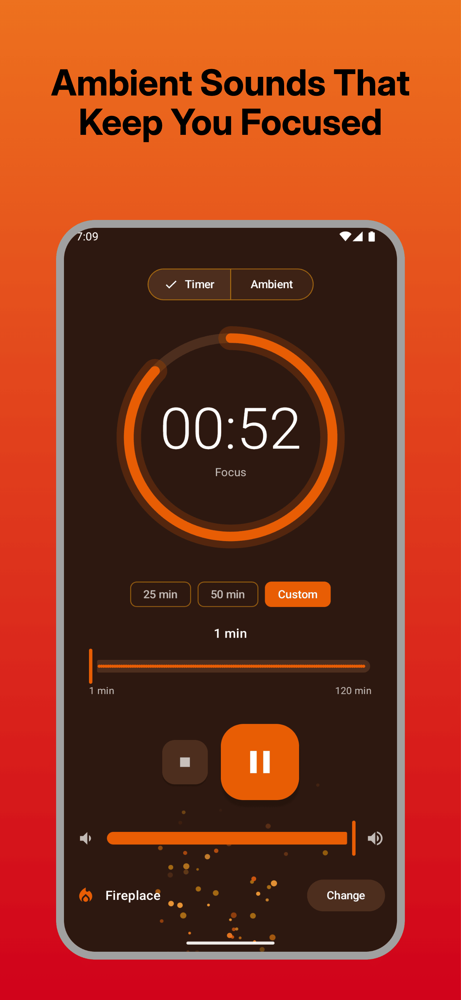
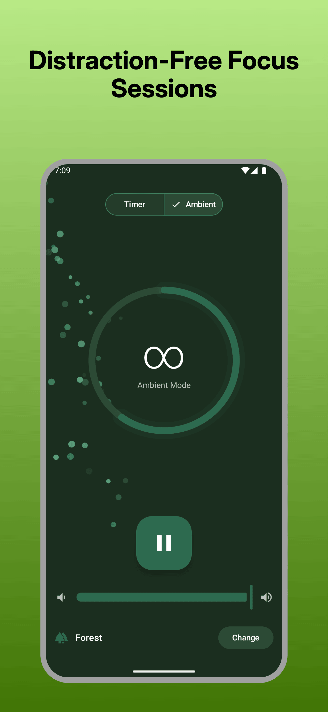
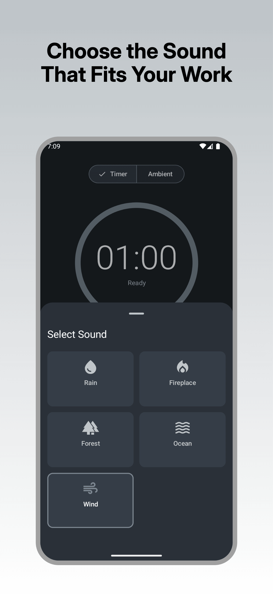

<p align="center">
  
</p>

<h1 align="center">Ambio</h1>

<p align="center">
  <strong>Focus timer with ambient sounds for deep work sessions.</strong>
</p>

<p align="center">
  
  
  
  
  
</p>

---

> **Under Construction**
> Ambio is in active development. Core features work, but expect rough edges. Contributions welcome!

---

## About

**Ambio** combines focus timers with immersive ambient soundscapes to help you achieve deep work. Unlike basic timer apps, Ambio adapts its entire visual theme to match your chosen sound, creating a cohesive, distraction-free environment.

Choose rain, and the UI shifts to cool blues. Select fireplace, and warm oranges embrace you.

## Features

- **Pomodoro Timer** — 25-min and 50-min presets for focused work sessions
- **Ambient Mode** — Continuous playback without timer for relaxation or sleep
- **5 Soundscapes** — Rain, Fireplace, Forest, Ocean, Wind (CC0 licensed)
- **Dynamic Theming** — UI colors animate smoothly to match selected sound
- **Background Playback** — Media notification controls, keeps playing when minimized
- **Haptic Feedback** — Subtle vibrations for interactions
- **Timer Chime** — Gentle notification when focus session completes
- **Offline-First** — All sounds bundled, no internet required

## Screenshots

<p align="center">
  
  
  
</p>

## Tech Stack

| Technology | Purpose |
|------------|---------|
| **Jetpack Compose** | Declarative UI framework |
| **Material Design 3** | Modern design system |
| **Media3** | Background audio with MediaSessionService |
| **Hilt** | Dependency injection |
| **DataStore** | User preferences persistence |
| **Room** | Session history database |
| **Kotlin Coroutines** | Async operations & Flow |
| **Clean Architecture** | Multi-module MVVM structure |

## Architecture

Ambio follows **Clean Architecture** with a multi-module structure:

```
app/           # Main application entry point
core/
  common/      # HapticManager, extensions
  data/        # Repository implementations, Room, DataStore
  domain/      # Models, interfaces, use cases
  di/          # Hilt modules
feature/
  home/        # HomeScreen, ViewModel, UI components
media/         # AudioService, MediaSession integration
ui/            # Theme system, typography, shapes
```

## Requirements

- Android 12+ (API 31)
- Java 17
- Android Studio Ladybug or newer

## Getting Started

1. Clone the repository
   ```bash
   git clone https://github.com/jaimebg/Ambio.git
   cd Ambio
   ```

2. Build and run:

   **With Android Studio:**
   ```bash
   open -a "Android Studio" .
   ```
   Then press Run (Shift+F10).

   **With command line:**
   ```bash
   ./gradlew assembleDebug
   adb install app/build/outputs/apk/debug/app-debug.apk
   ```

## Build Commands

```bash
./gradlew assembleDebug   # Build debug APK
./gradlew lint            # Run lint checks
./gradlew test            # Run unit tests (75 tests)
./gradlew clean           # Clean build cache
```

## Contributing

1. Fork -> branch -> commit -> PR
2. Follow existing code style
3. Ensure `./gradlew lint` passes with 0 warnings
4. Add tests for new functionality

## License

This project is licensed under the MIT License - see the [LICENSE](LICENSE) file for details.

Audio files are CC0 (public domain).

---

<p align="center">
  Made with care by <a href="https://jbgsoft.com">JBGSoft - Jaime Barreto</a> 🧡
</p>
