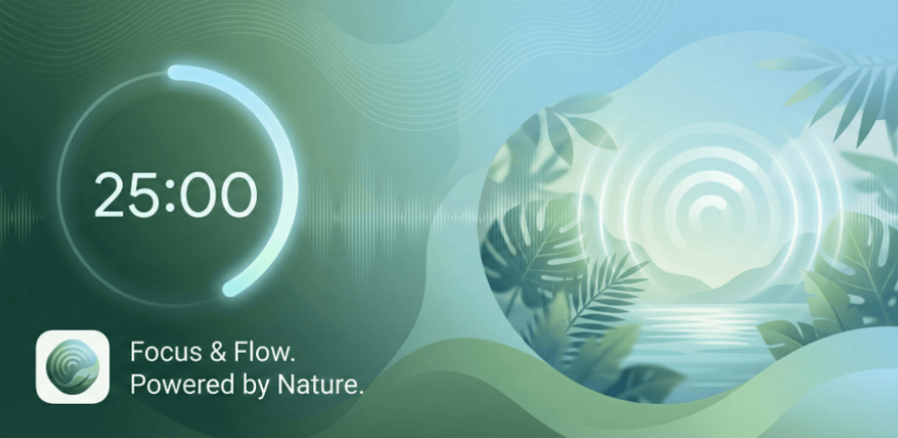
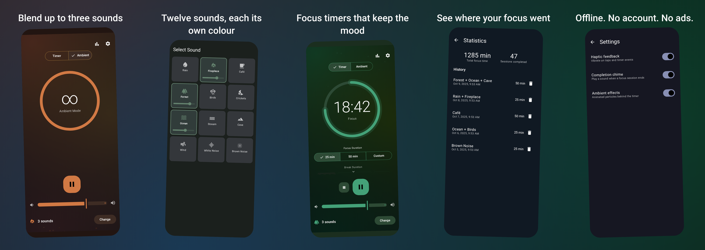

<p align="center">
  
</p>

<h1 align="center">Ambio</h1>

<p align="center">
  <strong>Blend up to three ambient sounds into a focus soundscape you build yourself.</strong>
</p>

<p align="center">
  <a href="https://play.google.com/store/apps/details?id=com.jbgsoft.ambio">
    
  </a>
  <a href="https://github.com/jaimebg/Ambio/releases/latest">
    
  </a>
  <a href="https://github.com/jaimebg/Ambio/actions/workflows/ci.yml">
    
  </a>
</p>

<p align="center">
  
  
  
  
  
</p>

<p align="center">
  
</p>

---

## About

**Ambio** turns focus time into an environment you build yourself. Pick up to three ambient
sounds, set how loud each one sits in the mix, and the whole app answers: colour, light and
motion follow what you made.

Rain over a distant café gives you cool blues. Fireplace under wind gives you warm amber.
The background gradient and the particles behind the timer are blended from every sound in
the mix, not just one of them.

## Features

- **Three-Sound Mixer** — Blend up to three sounds at once, each with its own level
- **12 Soundscapes** — Rain, Fireplace, Café, Forest, Birds, Crickets, Ocean, Stream, Cave, Wind, White Noise, Brown Noise (CC0 / public domain)
- **Dynamic Theming** — The palette is mixed from every sound in the mix, not just one
- **Ambient Visuals** — A particle field behind the timer that answers the whole mix, and can be switched off
- **Pomodoro Timer** — 25-min and 50-min presets, or your own focus and break lengths
- **Ambient Mode** — Continuous playback without a timer, for relaxation or sleep
- **Session History** — Statistics for the hours you actually put in
- **Adaptive Tablet Layout** — Two panes, the mixer permanently beside the timer past 840dp
- **47 Languages** — The app itself, with per-app language selection on Android 13+
- **Background Playback** — Media notification controls and a Quick Settings tile
- **Haptic Feedback** — Subtle vibrations for interactions
- **Timer Chime** — Gentle notification when a focus session completes
- **Offline-First** — All sounds bundled, no internet required, no account, no ads, no tracking

## Screenshots

<p align="center">
  
</p>

## Tech Stack

| Technology | Purpose |
|------------|---------|
| **Jetpack Compose** | Declarative UI framework |
| **Material Design 3** | Modern design system |
| **Media3** | Background audio with MediaSessionService |
| **Hilt** | Dependency injection |
| **DataStore** | User preferences persistence |
| **Room** | Session history database |
| **Kotlin Coroutines** | Async operations & Flow |
| **Clean Architecture** | Multi-module MVVM structure |

## Architecture

Ambio follows **Clean Architecture** with a multi-module structure:

```
app/           # Main application entry point
core/
  common/      # HapticManager, extensions
  data/        # Repository implementations, Room, DataStore
  domain/      # Models, interfaces, use cases
  di/          # Hilt modules
feature/
  home/        # HomeScreen, the mixer, timer and transport
  settings/    # SettingsScreen
  stats/       # StatsScreen, session history
  tile/        # Quick Settings tile
media/         # AudioService, MediaSession integration
ui/            # Theme system, mix gradient, particle field
store-assets/  # Renders the Play Store screenshots on the JVM (test-only)
fdroid/        # Reference copy of the fdroiddata build recipe
metadata/      # Published F-Droid store listing (synced from fastlane/, tracked in git)
```

## Requirements

- Android 12+ (API 31)
- Java 17
- Android Studio Otter or newer (AGP 9 requires it)

## Getting Started

1. Clone the repository
   ```bash
   git clone https://github.com/jaimebg/Ambio.git
   cd Ambio
   ```

2. Build and run:

   **With Android Studio:**
   ```bash
   open -a "Android Studio" .
   ```
   Then press Run (Shift+F10).

   **With command line:**
   ```bash
   ./gradlew assembleDebug
   adb install app/build/outputs/apk/debug/app-debug.apk
   ```

## Build Commands

```bash
./gradlew assembleDebug          # Build debug APK
./gradlew lint                   # Run lint checks
./gradlew test                   # Run unit tests (724: 362 tests × debug and release variants)
./gradlew clean                  # Clean build cache
./gradlew syncFdroidMetadata     # Refresh metadata/ from fastlane/ after changing store text
./gradlew validateFdroidMetadata # Check metadata/ against F-Droid's limits (runs on CI)
```

## Contributing

1. Fork -> branch -> commit -> PR
2. Follow existing code style
3. Ensure `./gradlew lint` passes with 0 warnings
4. Add tests for new functionality

## License

This project is licensed under the MIT License - see the [LICENSE](LICENSE) file for details.

Audio files are CC0 (public domain). Per-sound provenance is recorded in
[ATTRIBUTION.md](ATTRIBUTION.md): five sounds are traceable to Freesound
originals via [`audio-src/sources.json`](audio-src/sources.json), two are
generated by `tools/synth-noise.sh`, and six predate the manifest — their
source audio is retained in [`audio-src/`](audio-src/README.md), but their
upstream provenance is documented there as unrecoverable.

---

<p align="center">
  Made with care by <a href="https://jbgsoft.com">JBGSoft - Jaime Barreto</a> 🧡
</p>
